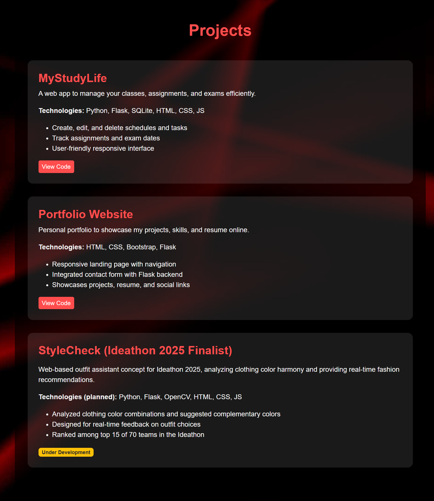

# Personal Portfolio Website  

A responsive personal portfolio built using HTML, CSS, and Python (Flask) to showcase my skills, projects, and achievements. This portfolio highlights my work, experiences, and provides a way to connect with me professionally. 

## Tech Stack  
- Frontend: HTML, CSS (Bootstrap)
- Backend: Python (Flask framework)
- Other: Bootstrap (for responsive design) 

## Features
- Fully responsive design, works on desktop and mobile
- Sections for About Me, Projects, Skills, and Contact
- Contact form integrated with Flask backend
- Easy to extend with new projects or content

## Screenshots

### Homepage


### Resume


### Projects Section


### Contact Form


## How to Run Locally  

1. Clone the repository  
   ```bash
   git clone https://github.com/sreejareddy-24/Portfolio.git
   cd Portfolio
   ```

2. Install dependency (Flask)
    ```bash
    pip install flask
    ```

3. Run the app
    ```bash
    python app.py
    ```

4. Open in browser:
    ```bash
    http://127.0.0.1:5000
    ```

